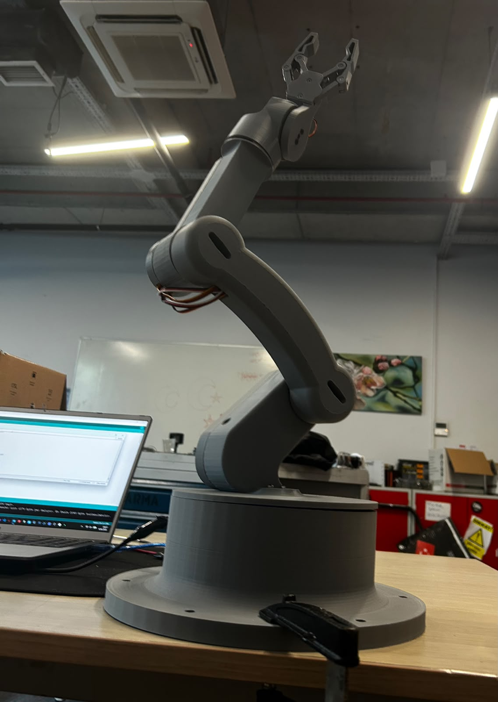

# 6-DOF Robot Arm / 6 Eksenli Robot Kol

Arduino Uno + PCA9685 ile kontrol edilen, bilgisayar klavyesinden komut alarak çalışan 6 servolu robot kol projesi.

A 6-servo robotic arm controlled with Arduino Uno and a PCA9685 PWM driver, driven by simple keyboard commands from the serial monitor.



---

## Hardware / Donanım

### Arduino Uno R3
- Microcontroller: ATmega328P
- Operating voltage: 5V
- Digital I/O pins: 14 (6 PWM)
- Analog input pins: 6
- Flash memory: 32 KB
- Clock speed: 16 MHz
- Communication: UART, I2C (A4=SDA, A5=SCL), SPI
- Görev: PCA9685'e I2C üzerinden komut gönderir, seri porttan klavye komutlarını alır.

### PCA9685 16-Channel PWM/Servo Driver
- 16 kanal, 12-bit (4096 adım) PWM çözünürlüğü
- I2C arabirimi (varsayılan adres: 0x40)
- 24 Hz – 1526 Hz frekans aralığı (projede 50 Hz kullanıldı)
- Ayrı V+ terminali ile servo motorlar için harici güç beslemesi
- Logic voltage: 3.3V / 5V uyumlu
- Görev: 6 servoyu eş zamanlı PWM sinyali ile sürer.

### Servo Motors / Servo Motorlar

| Slot | Channel | Model | Type | Torque | Görev / Role |
|------|---------|-------|------|--------|---------------|
| **S1** | 1 | MG996R | Continuous rotation | ~10 kg·cm @ 6V | Base / Taban |
| **S0** | 0 | DS Servo 60KG | Continuous rotation, dijital | ~60 kg·cm @ 6.8V | Shoulder / Omuz |
| **S2** | 2 | MG996R | Positional (slow stepped) | ~10 kg·cm @ 6V | Upper arm / Üst kol |
| **S3** | 3 | MG90S | Positional (4 fixed angles) | ~1.8 kg·cm @ 4.8V | Elbow / Dirsek |
| **S4** | 4 | MG90S | Positional (4 fixed, slow) | ~1.8 kg·cm @ 4.8V | Wrist / Bilek |
| **S5** | 5 | MG90S | Positional (3 fixed) | ~1.8 kg·cm @ 4.8V | Gripper / Tutucu |

### Power Supply / Güç Kaynağı
- Ayarlanabilir DC güç kaynağı **9V**'a ayarlandı, PCA9685'in V+ terminaline bağlandı.
- Sistem çalışırken ölçümde ekranda **~7V** görüldü; servoların yük altında çektiği akım nedeniyle gerilim 7V seviyesine düştü (gerçek besleme bu).
- Arduino, USB üzerinden 5V ile besleniyor.
- **GND ortak**: Güç kaynağı GND, PCA9685 GND ve Arduino GND breadboard üzerinde aynı hatta birleştirildi (ortak topraklama şart).

---

## Wiring / Bağlantılar

### Arduino → PCA9685
| Arduino | PCA9685 |
|---------|---------|
| 5V      | VCC     |
| GND     | GND     |
| A4      | SDA     |
| A5      | SCL     |

### Power Supply → PCA9685
| PSU | PCA9685 (yeşil terminal) |
|-----|--------------------------|
| +9V (yük altında ~7V) | V+ |
| GND | GND (Arduino GND ile ortak) |

### Servos → PCA9685
- Her servo PCA9685 üzerindeki kendi kanalına 3-pin (GND/V+/PWM) konektörle takılır.
- S0→Ch0, S1→Ch1, S2→Ch2, S3→Ch3, S4→Ch4, S5→Ch5

---

## Commands / Komutlar

Komutlar Arduino IDE seri monitör (115200 baud) veya `kontrol.py` üzerinden gönderilir.

### S1 – Base / Taban (MG996R, continuous)
| Key | Action |
|-----|--------|
| `1` | Sola döndür / Turn left |
| `2` | Sağa döndür / Turn right |
| `3` | Durdur / Stop |

### S0 – Shoulder / Omuz (DS 60KG, continuous)
| Key | Action |
|-----|--------|
| `4` | Sola / Left |
| `5` | Sağa / Right |
| `6` | Durdur / Stop |

### S2 – Upper Arm / Üst Kol (MG996R, slow positional)
| Key | Position | Pulse |
|-----|----------|-------|
| `7` | Pos 1 | 150 |
| `8` | Pos 2 (orta) | 375 |
| `9` | Pos 3 | 600 |

### S3 – Elbow / Dirsek (MG90S, 4 positions)
| Key | Pulse |
|-----|-------|
| `Q` | 100 |
| `W` | 267 |
| `E` | 433 |
| `R` | 600 |

### S4 – Wrist / Bilek (MG90S, 4 positions, slow)
| Key | Pulse |
|-----|-------|
| `A` | 100 |
| `S` | 267 |
| `D` | 433 |
| `F` | 600 |

### S5 – Gripper / Tutucu (MG90S, 3 positions)
| Key | Pulse |
|-----|-------|
| `G` | 100 |
| `H` | 350 |
| `J` | 600 |

### Other
| Key | Action |
|-----|--------|
| `STOP` | Tüm servoları durdur / Cut all signals |

---

## Software / Yazılım

### Required libraries
- `Wire.h` (built-in)
- `Adafruit_PWMServoDriver.h` (Library Manager → "Adafruit PWM Servo Driver Library")

### Files
- `robot_kol/robot_kol.ino` – Arduino firmware
- `kontrol.py` – Python serial command sender (optional, COM4 @ 115200)

### Python control
```bash
pip install pyserial
python kontrol.py
```

---

## Notes / Notlar

- Continuous rotation servolar (S0, S1) açı kontrolü değil yön kontrolü yapar; PWM=350 civarında dur, daha küçük/büyük değerlerde dönerler.
- Pozisyonel servolar (S2, S3, S4, S5) için pulse değeri ↔ açı eşleşir.
- MG90S motorların ısınmaması için pozisyona ulaştıktan sonra sinyal kesilir (`pwm.setPWM(ch, 0, 4096)`).
- S2 ve S4 için adım adım yumuşak hareket fonksiyonları kullanılır.
